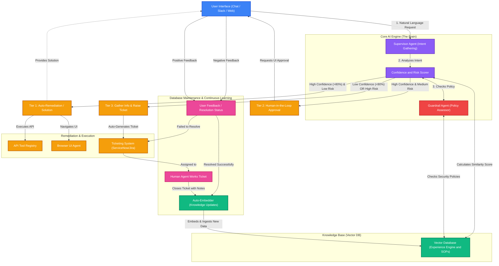

# Aegis (Ryan Resolve AI) - Hackathon Architecture & Concept

## The Challenge
Design an end-to-end, scalable, governance-aligned, intelligent, and intuitive AI-enabled Issues Management solution. The lifecycle must cover: intake -> analysis -> remediation -> sustainment -> closure.

## Core Features
1. **Dual-Agent Architecture**: A `Supervisor Agent` to understand intent/gather info, and a `Guardrail Agent` to assess risk and company policy.
2. **Dynamic Confidence Scoring (Experience-Based)**: Before acting, the system calculates a Confidence Score (0-100%). This is not just naive similarity. It combines:
   - *Similarity Score*: How closely the request matches past tickets in the Vector DB.
   - *Historical Success Rate (Experience)*: The DB returns the *status* of similar past tickets. If prior similar tickets were successfully resolved by an AI tool (e.g., `BrowserAgent`), confidence goes up. If they were escalated to humans, confidence goes down.
   - *LLM Certainty*: The LLM evaluates its own ability to parse the exact parameters needed for the tools.
3. **Risk & Confidence Tiering**:
   - *Tier 1 (High Confidence, Low Risk)*: Auto-remediation (e.g., password reset).
   - *Tier 2 (High Confidence, Medium Risk)*: Human-in-the-Loop (HITL). Prepares action, pauses for approval.
   - *Tier 3 (Low Confidence, High Risk)*: Escalation. Raises a rich, contextual ticket for a human.
4. **UI/Browser Automation Agent**: For legacy systems without APIs, the AI visually navigates the web portal to solve issues.
5. **Vector DB as an Experience Engine**: Unlike naive RAG, the agent queries the DB to learn *how* to act, understand environmental context/blast radius, and enforce strict governance policies.
6. **Continuous Learning Loop**: When human agents resolve escalated tickets, resolution notes are embedded into the DB, making the system smarter over time.
7. **Plug-and-Play Microservice**: API-first layer that can connect to any interface (Slack, Teams, Web UI).

## Proposed Technical Stack
- **Agent Framework**: Microsoft Semantic Kernel (.NET)
- **LLM**: GPT-4o / Claude 3.5 Sonnet (via Azure OpenAI or direct API)
- **Vector DB**: Supabase (pgvector) / Azure AI Search
- **Backend Orchestration**: C# + .NET 8 Web API
- **Frontend UI**: Next.js (Vercel AI SDK) or Blazor (for a pure .NET stack)
- **Browser Automation**: Playwright (.NET bindings)

## Architecture Diagram

